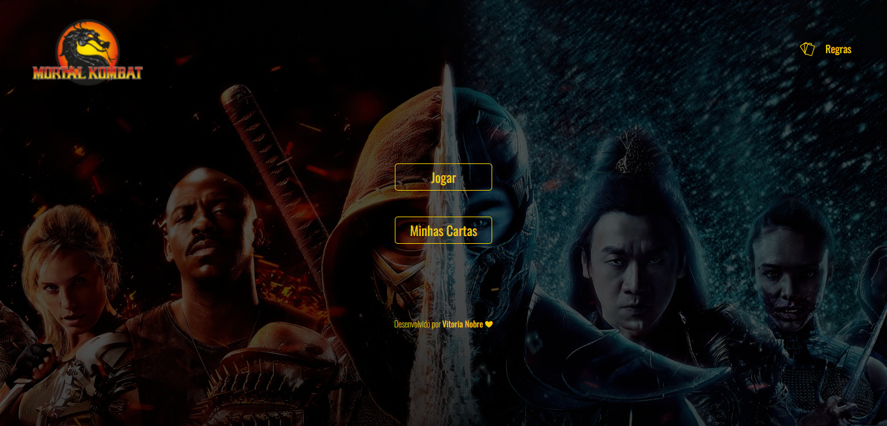

<h1 align="center">
  Super-Trunfo Mortal Kombat  
</h1>

  <a href="#-tecnologias">Tecnologias</a>&nbsp;&nbsp;&nbsp;|&nbsp;&nbsp;&nbsp;
  <a href="#-projeto">Projeto</a>&nbsp;&nbsp;&nbsp;|&nbsp;&nbsp;&nbsp;
  <a href="#memo-licença">Licença</a>

  
  

 

## 📖 Descrição

Esta aplicação é o clássico jogo Super Trunfo, com o tema da franquia Mortal Kombat. No jogo o objetivo é escolher uma habilidade para disputar com o adversário e comparar quem tem o personagem com a maior habilidade. Quem vencer a rodada ganha a carta do adversário.
 
 
A aplicação foi desenvolvida para desktop e se adapta, responsivamente, ao mobile.

## 🚀 Tecnologias

Este projeto foi desenvolvido com as seguintes tecnologias:

- HTML
- CSS
- JavaScript

## 🚧 Projeto

Live Preview: https://super-trunfo-mortal-kombat.vercel.app/

## 🎨 Inspiração

[Figma](https://www.figma.com/community/file/1068232132986774580?preview=fullscreen)

## 🎨 Créditos

Cartas: https://mortalkombat-mobile.fandom.com/wiki/Mortal_Kombat_X_Mobile_Wikia

## 📝 Licença

Esse projeto está sob a licença MIT. Veja o arquivo [LICENSE](.github/LICENSE) para mais detalhes.

---

Feito com ♥ by Vitoria Nobre